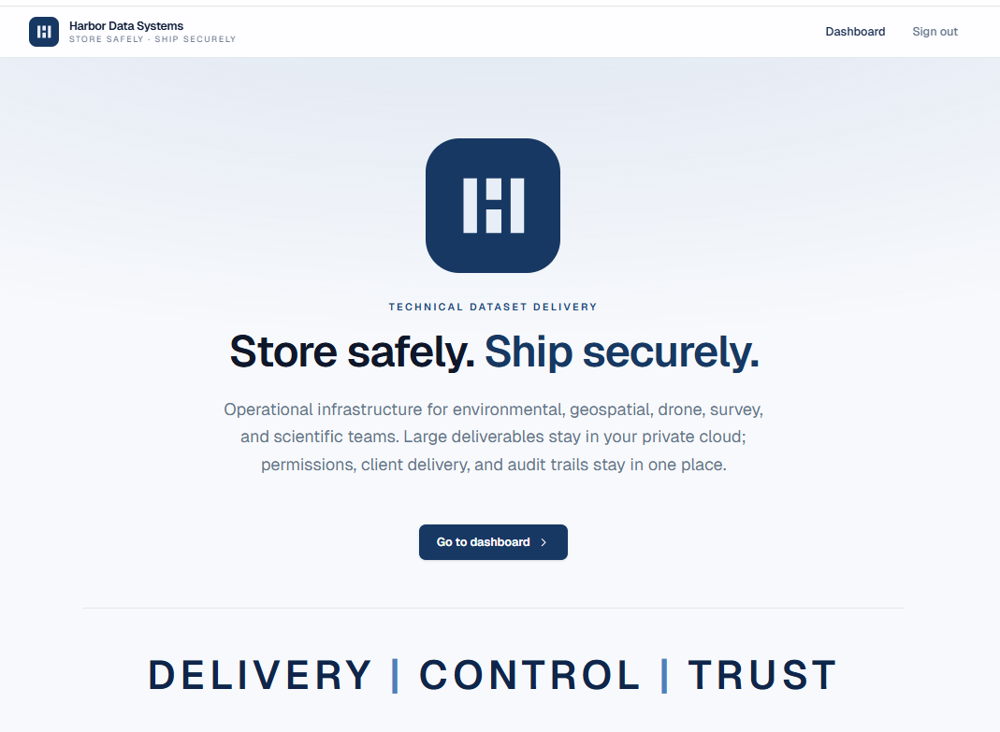
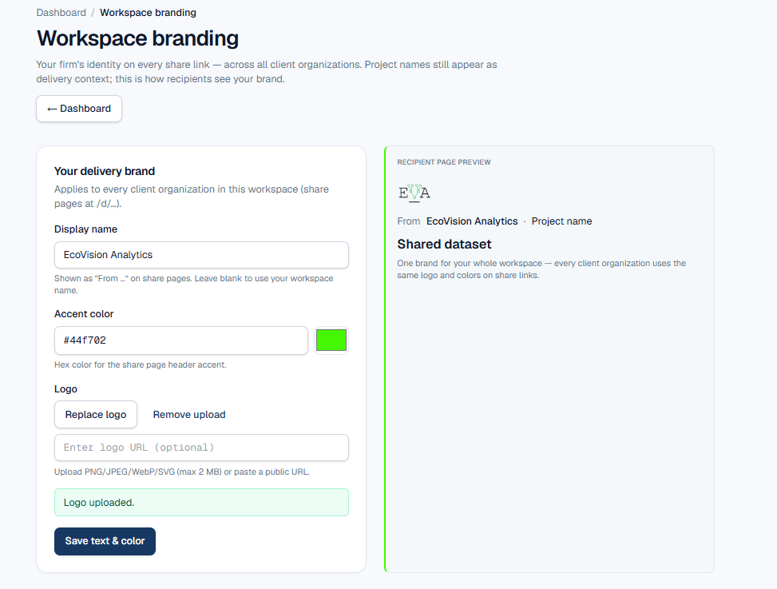
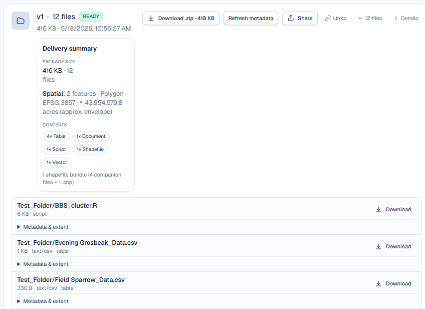
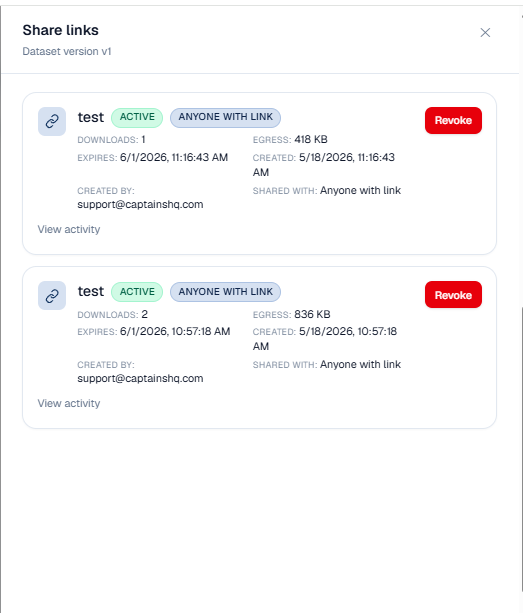
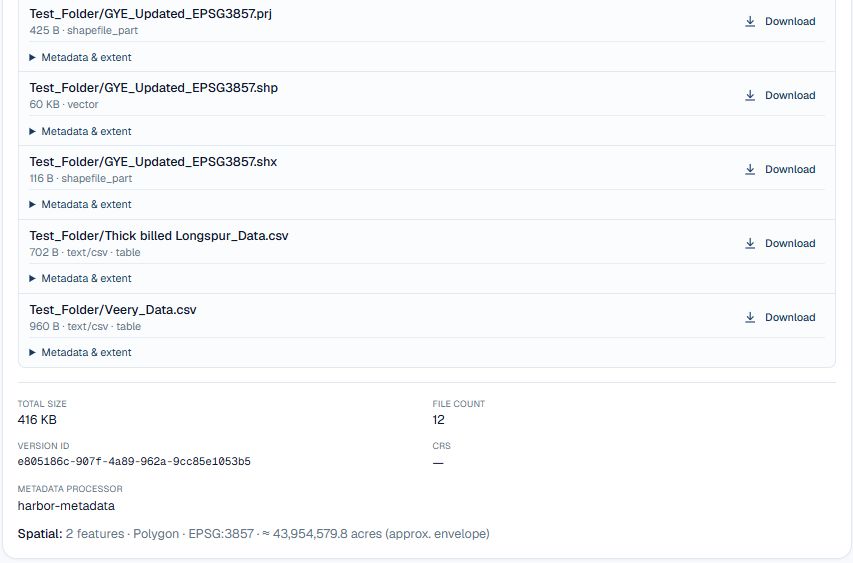
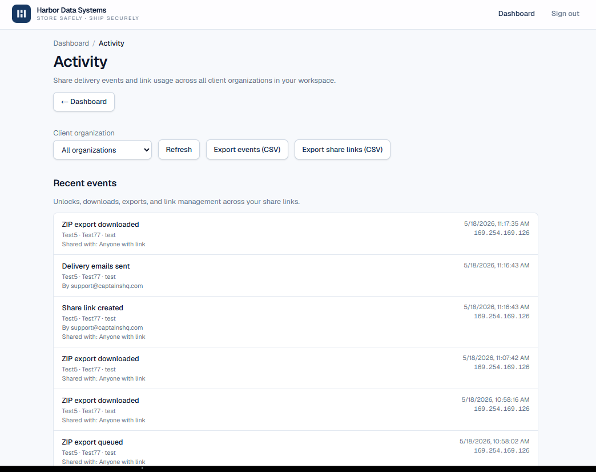
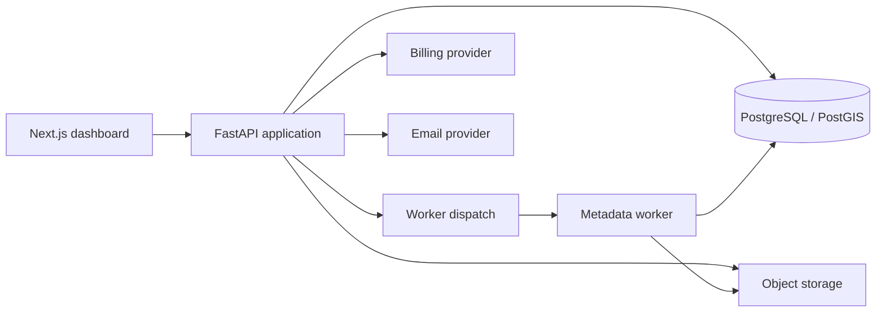

# HarborSystems Cloud Geospatial Platform

HarborSystems is a cloud-based project delivery platform for technical and scientific firms. It is geospatially aware, metadata aware, secure, auditable, and built around team-oriented delivery workflows.

This repository is a public case study. It documents the product and architecture without exposing production source code or monetized implementation details.

## Product Focus

- Secure file and project delivery for scientific and technical teams.
- Dataset metadata extraction and structured delivery summaries.
- Geospatially aware project organization.
- Share links, audit logs, activity tracking, and team access patterns.
- Workspace branding for client-facing delivery experiences.

## Product Screenshots

| Product landing | Workspace branding |
| --- | --- |
|  |  |

| Secure delivery | Share management |
| --- | --- |
|  |  |

| Dataset metadata | Activity log |
| --- | --- |
|  |  |

## What This Repo Demonstrates

- Multi-tenant geospatial SaaS architecture.
- FastAPI service design.
- PostgreSQL/PostGIS data modeling.
- Dataset, version, share-link, and delivery workflows.
- Object storage and signed delivery patterns.
- Background worker dispatch for metadata extraction and file processing.
- Account/team access control, usage tracking, billing boundaries, and audit logs.
- Next.js dashboard interface patterns.

## Source Material

Private/source folder reviewed:

- `HarborSystem`

Existing stack signals:

- FastAPI.
- SQLAlchemy and Alembic.
- PostgreSQL/PostGIS via GeoAlchemy.
- Google Cloud Storage and Cloud Run.
- Next.js dashboard.
- Stripe billing.
- Worker process for metadata extraction.

## Publication Mode

Case study only. HarborSystems is a monetized platform, so the public repo focuses on product architecture, screenshots, deployment philosophy, and engineering decisions rather than production source code.

## Architecture Sketch

